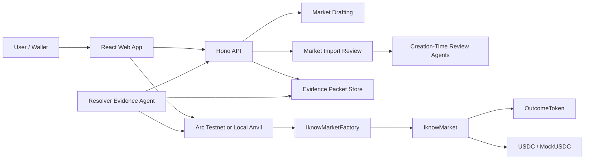

# iknow

> Create the market. Prove the outcome. Settle in USDC.

`iknow` is an Arc-native AMM prediction market factory where anyone can create fully collateralized YES/NO markets, seed liquidity with USDC, trade outcomes, and settle results with transparent agent evidence packets.

The goal is simple: make prediction markets feel dollar-native, liquid from the first transaction, and safer to create and resolve without trusting a black-box oracle.

## Why It Matters

Prediction markets are powerful, but launching a good market is still too hard:

- New markets often have no liquidity.
- Market wording is easy to make ambiguous.
- Resolution can feel opaque or discretionary.
- Crypto onboarding adds friction before the user reaches the actual product.

`iknow` solves the hackathon MVP version of that problem with creator-seeded AMM liquidity, USDC collateral, Arc-native transactions, creation-time market review agents, and resolution-time evidence agents.

## What It Does

- Create binary YES/NO prediction markets.
- Collateralize markets with USDC.
- Seed liquidity at creation so a market is tradable immediately.
- Draft contract-ready market creation inputs from user or imported market metadata.
- Review imported markets before creation and return `ready`, `needs-review`, or `rejected`.
- Validate whether a future resolver agent can objectively resolve the market.
- Buy or sell YES/NO exposure through a fixed-product AMM.
- Add and remove LP liquidity.
- Track creator deposits, LP shares, positions, fees, and claimable balances.
- Prepare resolver evidence packets for closed markets with outcome, confidence, sources, facts, and invalid checks.
- Propose, finalize, and redeem resolved markets through the resolver flow.
- Import market ideas and review whether their resolution rules are safe enough to launch.
- Run against a local Anvil chain or Arc Testnet deployment artifacts.

## Demo Flow

1. Open the web app and browse live or local markets.
2. Import or draft a YES/NO market idea.
3. Run creation-time review: binary outcome checks, close-time checks, resolution source extraction, invalid-condition sanity checks, and resolver compatibility.
4. Review the agent result: `ready`, `needs-review`, or `rejected`, plus rewritten resolution rules and evidence plan.
5. Create the market and seed USDC liquidity through the factory.
6. Trade YES or NO from the market detail page.
7. Add or remove liquidity as an LP.
8. After close, run the resolver agent to prepare an evidence packet.
9. Inspect the suggested outcome, confidence, source links, extracted facts, policy decision, and invalid-condition checks.
10. Propose and finalize the result.
11. Redeem winning outcome tokens or claim creator/LP/protocol balances.

## Agent Layer

`iknow` uses agents at two different points in the market lifecycle.

### 1. Creation-Time Market Review

Before an imported market goes live, the API reviews whether it can be resolved later. The review layer checks:

- Whether the market is binary and maps cleanly to YES/NO.
- Whether the close time is valid and in the future.
- Whether the resolution source is specific enough.
- Whether invalid conditions cover cancellation, ambiguity, unavailable evidence, and changed source metadata.
- Whether the resolver has the capabilities needed to settle it after close.

The review can return:

- `ready`: safe enough for autonomous resolver flow.
- `needs-review`: possible, but a human should inspect the rules or missing capabilities.
- `rejected`: not safe to launch as an iknow market.

The agent review also produces a rewritten resolution source, rewritten invalid conditions, required capabilities, missing capabilities, reviewer reports, and an evidence plan. This makes market creation safer than a blank text box.

### 2. Resolution-Time Evidence Agent

After a market closes, the resolver agent can scan eligible markets and prepare a validated evidence packet. Each packet includes:

- Suggested outcome: `YES`, `NO`, or `INVALID`.
- Confidence score.
- Public evidence links.
- Extracted facts tied to source URLs.
- Invalid-condition checks.
- Agent id and policy version.
- Policy decision such as `AUTO_PROPOSE`, `NEEDS_REVIEW`, or `REFUSE`.

The agent may recommend and prepare a proposal, but the contract and authorized resolver flow decide final settlement. Ambiguous markets are designed to stop at review instead of silently resolving.

## Core Protocol Model

Each market has two outcomes:

```txt
YES
NO
```

The collateral invariant is:

```txt
1 USDC -> 1 YES + 1 NO
1 YES + 1 NO -> 1 USDC
```

After resolution:

```txt
YES wins -> YES redeems 1 USDC, NO redeems 0
NO wins  -> NO redeems 1 USDC, YES redeems 0
INVALID  -> matched complete sets can unwind
```

The MVP fee model charges 30 bps per trade:

- 20 bps to LPs
- 5 bps to the market creator
- 5 bps to the protocol recipient

Creator bonds and initial liquidity are tracked separately. Current MVP floors are 5 USDC for the creation bond and 10 USDC for initial liquidity.

## Architecture



## Tech Stack

- **Contracts:** Solidity, Foundry
- **Frontend:** Vite, React, TypeScript
- **Wallet/chain:** wagmi, viem, Arc Testnet
- **API:** Hono, TypeScript, Zod
- **Agents:** creation-time import review, resolver policy, evidence packet generation, optional LLM-backed review/evidence modes
- **Resolver:** TypeScript CLI/watch runner for prepare, propose, finalize, and watch flows
- **Shared packages:** contract ABIs, schemas, constants, deployment models

## Why Arc And Circle

`iknow` is designed around a dollar-native market lifecycle:

- Create markets with USDC.
- Seed AMM liquidity with USDC.
- Buy and sell YES/NO with USDC.
- Pay trading fees in USDC.
- Use Arc as the settlement layer.
- Redeem winnings in USDC.

That makes Arc a natural fit because the product does not need a separate "crypto accounting" layer around the market. The contract model, UX, and settlement story can all speak in USDC.

Circle tooling is the path for making the funding and wallet experience feel less like infrastructure:

- Arc contracts for settlement and market logic.
- Circle Wallets docs and Modular Wallets for the passkey/smart-wallet direction.
- Circle Gas Station / Modular Wallet gasless transaction docs for sponsored or gasless wallet actions.
- App Kit-style Bridge, Send, Swap, and Unified Balance flows for getting users funded.
- Gateway/CCTP-style USDC movement into Arc as the product matures.

The current MVP focuses on Arc Testnet contracts, USDC-backed market logic, wallet-signed transactions, a Circle Modular Wallet passkey integration scaffold, and local/testnet demo flows. The broader Circle wallet and funding UX is captured in [`docs/wallet-product-spec.md`](docs/wallet-product-spec.md).

Relevant Circle docs:

- [Circle Wallets](https://developers.circle.com/wallets)
- [Circle Modular Wallets](https://developers.circle.com/wallets/modular)
- [Gasless transaction quickstart](https://developers.circle.com/wallets/gas-station/send-a-gasless-transaction.md)

## Workspace

```txt
contracts/        Solidity protocol and Foundry tests
apps/web/         Vite + React + TypeScript app
apps/api/         Hono API for drafts, deployment data, imports, and evidence
apps/resolver/    Resolver runner for evidence, proposal, and finalization flows
apps/indexer/     Envio indexer placeholder
packages/shared/  Shared schemas and constants
packages/abis/    Generated/exported contract ABIs
docs/             Product, protocol, wallet, and resolver notes
```

## Run Locally

Install dependencies:

```bash
pnpm install
```

Start a local chain:

```bash
pnpm chain:anvil
```

In a second terminal, deploy local contracts and seed demo markets:

```bash
pnpm chain:deploy
```

Start the API:

```bash
pnpm dev:api
```

Start the web app:

```bash
pnpm dev:web
```

For local-chain mode, set the web app environment to use the local deployment:

```bash
VITE_IKNOW_CHAIN_MODE=local
VITE_IKNOW_API_URL=http://127.0.0.1:8787
```

The local deploy script writes:

```txt
contracts/deployments/local-anvil.json
```

See [`docs/local-chain.md`](docs/local-chain.md) for local actors, deployment artifacts, and seeded market details.

## Arc Testnet

The repo also includes scripts for Arc Testnet deployment and market creation:

```bash
pnpm chain:deploy:arc
pnpm chain:create-market:arc
```

These require a funded Arc Testnet deployer key and the relevant environment variables. Arc deployment data is read by the API and web app through the deployment endpoints.

## Creation Review And Resolver Evidence

The create side has two layers:

- `/markets/draft` turns market input into contract-ready factory arguments.
- `/market-import/review` validates imported market rules and resolver compatibility before launch.

The review system uses deterministic guardrails plus reviewer roles for rule parsing, evidence-source checks, tooling fit, adversarial review, and policy review. It produces a launch status, score, blockers, warnings, rewritten rules, invalid conditions, and an evidence plan.

The resolver app can prepare evidence, propose outcomes, finalize markets, and watch for eligible markets:

```bash
pnpm --filter @iknow/resolver evidence:prepare
pnpm --filter @iknow/resolver evidence:propose
pnpm --filter @iknow/resolver evidence:finalize
pnpm --filter @iknow/resolver evidence:watch
```

Resolver policy is intentionally conservative:

- The agent can collect evidence and recommend outcomes.
- The agent can refuse or mark a market as needing human review.
- The contract and authorized resolver flow decide final settlement.
- Ambiguous markets should return `NEEDS_REVIEW` or refuse autonomous proposal.

See [`docs/resolver-agent-policy.md`](docs/resolver-agent-policy.md) for the policy model.

## Test

Run TypeScript checks:

```bash
pnpm typecheck
```

Run contract tests:

```bash
pnpm contracts:test
```

Run API tests:

```bash
pnpm --filter @iknow/api test
```

Run resolver tests:

```bash
pnpm --filter @iknow/resolver test
```

Current contract coverage includes outcome token permissions, complete-set mint/merge, market creation, AMM buy/sell, fee accounting, LP fee isolation, creation bond claim/slash, YES/NO redemption, INVALID unwind, resolution edge cases, and bounded fuzz accounting.

## Version One

This hackathon build proves the full loop: create an agent-reviewed market, collateralize it with USDC, seed AMM liquidity, trade YES/NO, prepare resolver evidence, finalize the outcome, and redeem winnings.

What is working now:

- Solidity factory, market, and outcome-token contracts.
- USDC-backed complete-set accounting.
- Fixed-product AMM trading for YES/NO markets.
- Creator bonds, initial liquidity, LP shares, and fee split accounting.
- Creation-time market draft and import review agents.
- Agent validation for binary outcomes, close times, resolution sources, invalid conditions, and resolver compatibility.
- `ready`, `needs-review`, and `rejected` launch decisions for imported markets.
- Resolver evidence packets with confidence, source links, extracted facts, invalid checks, and policy decisions.
- React app for browsing, creating, trading, LP actions, resolving, redeeming, and portfolio claims.
- Hono API for market drafts, evidence packets, market imports, deployment state, and Arc Testnet market indexing.
- Resolver tooling for evidence-backed prepare, propose, finalize, and watch flows.
- Local Anvil deployment with deterministic actors and seeded markets.
- Arc Testnet deployment support.
- Circle Modular Wallet passkey integration scaffold.
- Shared Zod schemas across apps and packages.
- Foundry, API, and resolver tests covering core protocol and agent behavior.

## Post-Hackathon Roadmap

V1 proves the full iknow lifecycle: agent-reviewed market creation, USDC-backed trading, evidence-backed resolution, and redemption. After the hackathon, the focus is turning that proof into infrastructure that can support more users, more markets, and stronger trust guarantees.

### Milestone 1: Scalable API And Indexed Read Model

The next priority is reducing reliance on direct RPC reads as the product moves beyond private alpha. Market discovery, market detail, portfolio state, claimable balances, lifecycle state, and resolver history should move toward an API-backed indexed read model.

Planned work:

- Event-indexed market list and market detail APIs.
- Portfolio and claim-state APIs.
- Cached market metadata and lifecycle snapshots.
- Better indexing recovery and replay for Arc Testnet.
- Search, filtering, sorting, and pagination for market discovery.
- Fewer frontend RPC calls on high-traffic screens.

### Milestone 2: Agent Tooling And Evidence Infrastructure

Creation and resolver agents should not only parse market text. They should gather evidence, evaluate sources, check market rules, and explain decisions clearly. As market volume grows, agents need better tools to resolve faster while still refusing ambiguous or unsafe cases.

This layer should also become an open interface for builders. Any approved agent, app, or API client should be able to draft markets, request creation review, attach evidence, and hand the result to iknow's resolver workflow through structured schemas instead of one-off integrations.

Planned work:

- Public API paths for agent-assisted market creation and evidence submission.
- Web search and source-reading tools for resolver agents.
- Source-specific evidence adapters for sports, crypto prices, onchain events, official announcements, and public datasets.
- Market-rule and resolution-source validation tools.
- Agent access to indexed market history and lifecycle state.
- Better evidence receipts with citations, extracted facts, invalid checks, and confidence.
- Benchmarks for ambiguous, conflicting, postponed, source-unavailable, and regulation-sensitive markets.
- Human-review workflow for `needs-review` cases.

### Milestone 3: Stronger Market Quality And Creation Review

The creation side is one of iknow's main advantages. Before markets go live, agents should help creators produce markets that can actually resolve.

Planned work:

- Better creator feedback when a market is ambiguous.
- Stronger `ready`, `needs-review`, and `rejected` decisions.
- Rewritten market rules, invalid conditions, and evidence plans before deployment.
- Category-specific creation review for sports, crypto, onchain, public events, and custom creator markets.
- Human-review queue for markets that are promising but not safe for autonomous resolution.
- Market quality scores that help creators understand launch readiness.

### Milestone 4: Liquidity And Market Mechanism Upgrades

Once the lifecycle and agent infrastructure are stronger, the protocol can support better liquidity and more expressive market mechanics while keeping the complete-set solvency model.

Planned work:

- Creator-selected initial odds.
- More AMM curve options beyond the first fixed-product design.
- Configurable fee tiers.
- Better LP analytics and inventory-risk views.
- Price-impact and depth previews before trades.
- Improved liquidity bootstrapping for new markets.
- Research toward multi-outcome markets after binary markets are reliable.

### Milestone 5: Production Hardening And Grant-Ready Growth

The final post-hackathon track is preparing the project for real external users, grants, and ecosystem pilots. The goal is to prove that the system is not only interesting, but maintainable, measurable, and safe to expand.

Planned work:

- More invariant, fuzz, and adversarial tests for contracts and agents.
- Monitoring for API, indexer, resolver, and contract events.
- Public testnet beta with curated market categories.
- Metrics for markets created, markets rejected, volume traded, liquidity seeded, and resolution accuracy.
- Clear grant milestones and ecosystem reporting.
- Security review and audit preparation before any production-funds deployment.

## Docs

- [`docs/vision.md`](docs/vision.md) - product thesis and long-term direction
- [`docs/contract-spec.md`](docs/contract-spec.md) - protocol model and contract behavior
- [`docs/local-chain.md`](docs/local-chain.md) - Anvil deploy and seeded demo flow
- [`docs/resolver-agent-policy.md`](docs/resolver-agent-policy.md) - resolver policy
- [`docs/wallet-product-spec.md`](docs/wallet-product-spec.md) - wallet and Arc/Circle UX direction
- [`contracts/README.md`](contracts/README.md) - contract workspace notes
